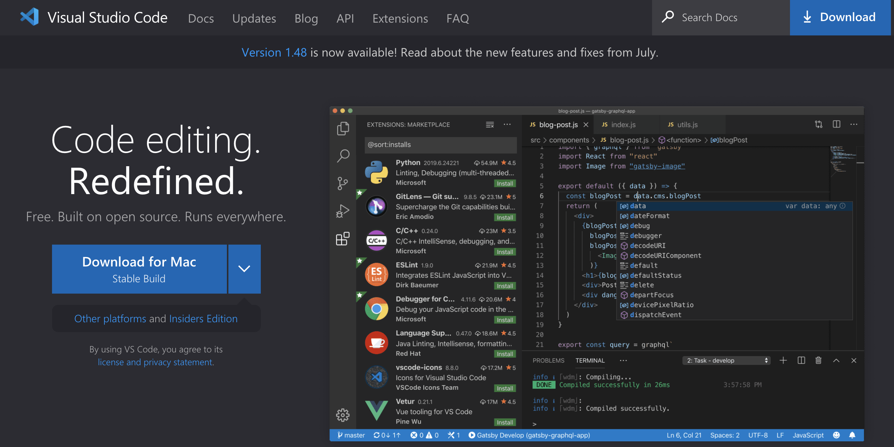
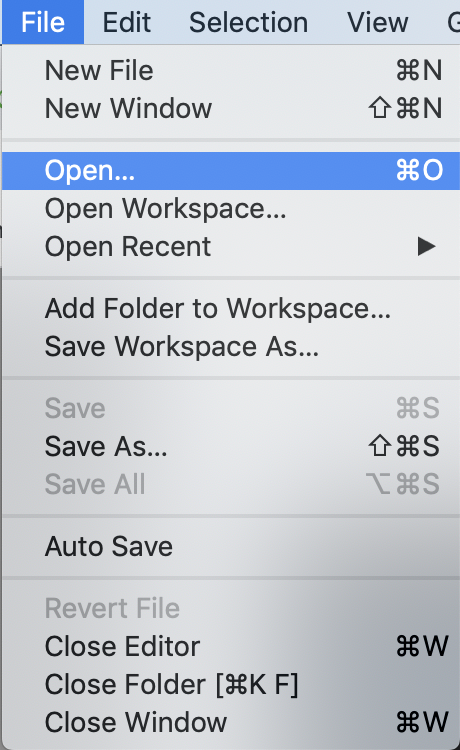
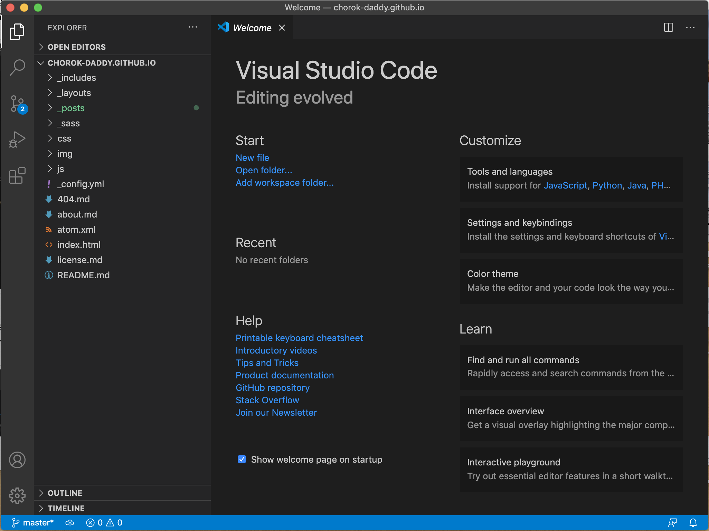
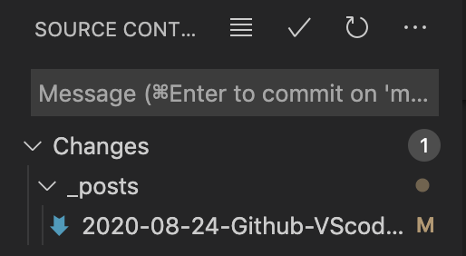

### 목적 
Github의 편리한 사용 + VScode가 요즘 hot하다고 하여,, 

### VScode 설치
<https://code.visualstudio.com/> 접속, 다운로드 및 설치

### Git 설치
(From <https://elvis-note.tistory.com/entry/Git-설치for-Mac>)
- 이미 설치가 되어있는지 확인 >> 터미널에서 'git --version'
- 설치가 안되어있거나, 새로운 version으로 설치하고 싶으면 'brew install git'

### Git repository 연결
- Local folder open (해당 folder에 .git이 있다고 git remote 설정한 적이 있다면 자동으로 연결됨)

    </img>
    </img>

- 비어있는 폴더라면, remode git 추가 (터미널에서 'git remote add origin repository_URL'
- 파일을 생성(또는 변경)하고 메뉴에서 commit한 후 push 하면 완료
- (보통 push to 에서 remote repository를 선택한다)

### 이후 작업
- 파일 수정 후 저장하면 왼쪽 메뉴바 changes에 추가되는 것을 볼 수 있다
{: width="50%"}
- 수정된 파일들 중 적용할 파일을 골라서 + 
- commit 후 push

