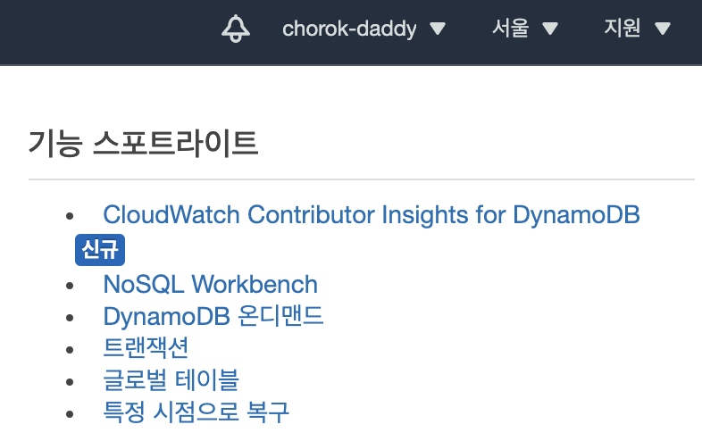
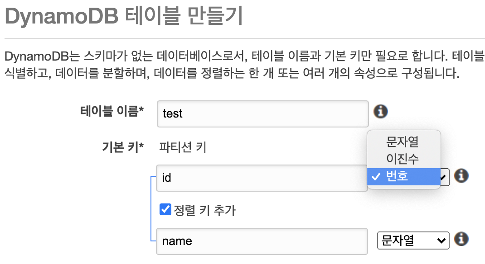
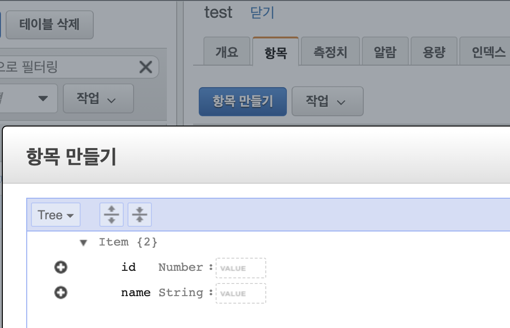

### AWS lambda 활용의 준비단계로 AWS에서 DynamoDB를 최초 세팅하는 방법 정리 
------

### Prerequisite
- AWS(aws.amazon.com) 가입 및 로그인
- DynamoDB는 Free tier로 사용할 수 있다

### 테이블 만들기
- 리전 선택 (우측 상단)

- 테이블은 UI에서 직접 만들어도 되고, 추후 lambda funcion에서 boto3 api 통해 만들 수 있다
- 대략 아무렇게나 만들어보고 데이터도 넣어보고 테스트 해본다

- 항목(데이터)도 넣어볼 수 있다

