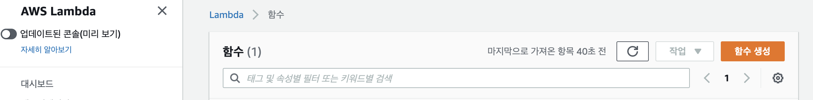
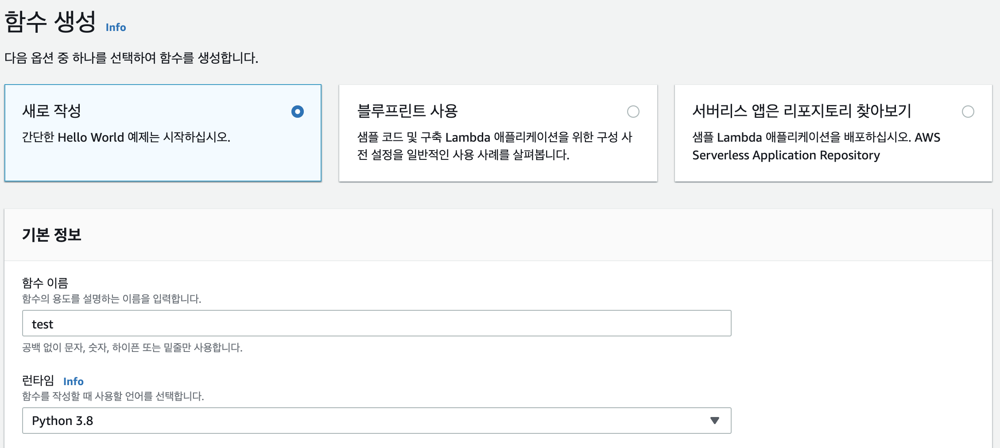
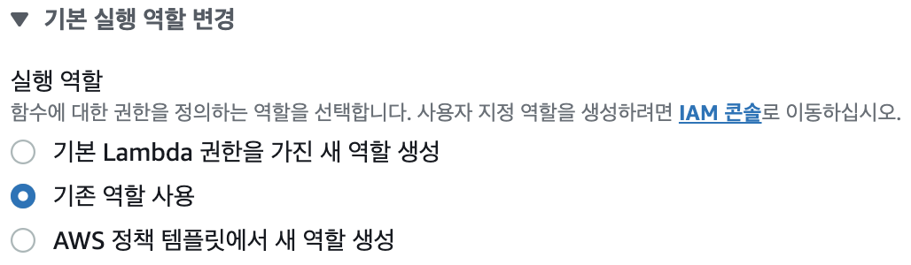
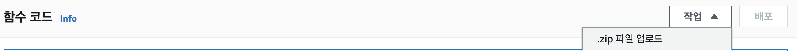

### AWS에서 lambda function을 이용해 DynamoDB에 읽고 쓰기 
------

### AWS Lambda 초기 세팅 #1
- Lambda 또한 DynamoDB와 마찬가지로 일정 자원 범위 내에서 기간 제한 없이 Free tier를 활용할 수 있다
- (Free tier에 관한 자세한 조건은 aws.amazion.com 참조)
- AWS Lambda 서비스로 이동하여 새로운 함수를 생성한다



- 함수 이름과 언어를 선택한다



- Lambda에서 DynamoDB를 control해야 하므로 기본권한 외에 추가권한이 필요하다
- 그림과 같이 두번째 항목을 선택



### Create new role 
- 이 상태에서 잠시 멈추고, 새로운 역할을 만들기 위해 [링크](https://console.aws.amazon.com/iam/home#/roles)를 새탭에서 오픈한다
- 역할 만들기를 클릭하고 사용사례에서 Lambda를 선택후 '다음'
- 정책 필터를 이용해 AmazonDynamoDBFullAccess, CloudWatchLogsFullAccess 추가하고 '다음'
- (참고로 CloudWatchLog는 실행 결과를 로깅하는데 필요하다)
- 키/값은 아무거나 하나 적당히 넣는다 (예, no/1) '다음'
- 이름을 적당히 정한 후 '역할 만들기'

### AWS Lambda 초기 세팅 #1
- 마지막으로 다시 Lambda 함수 만들던 창으로 돌아가서 기존 역할에서 방금 만든 역할을 선택한다
- '함수 생성'
- 생성한 함수의 이름을 클릭해 들어가면 디자이너 화면과 함수 코드 입력창이 보인다
- [이전글](Dynamo-Python Local DB control)에서 사용한 예제를 이용해 테스트해본다
- 여기까지의 과정은 [참조유투브](https://www.youtube.com/watch?v=8zhv6GDSDE8)를 참고하면 더 쉽다

### AWS Lambda에서 외부 라이브러리 사용하기
- 외부 라이브러리를 import하기 위해서는 해당 라이브버리를 폴더에 넣고 압축한 후 업로드해줘야한다



- 폴더를 새로 만들고 그 폴더 안에 다음과 같이 라이브러리와 소스코드로 채운다
- 예를 들어 터미널을 열고 해당 폴더로 이동한 다음 다음 커멘드를 입력하면 된다 (삭제 과정은 필요없는 캐시 제거)
```console
$ pip install -t . pandas
$ rm -r *.dist-info __pycache__
$ zip -r zip.zip .
```
- 만약 사용중인 PC의 OS가 AWS에서 lambda가 구동되는 OS와 호환이 잘 안된다면 업로드 해도 문제가 생길 가능성이 있다
- 이때는 도커를 이용해 AWS환경과 맞는 적당한 이미지(linux-python3.x)를 올리고, 그 안에서 위 작업을 수행한 다음 폴더들을 컨테이너 밖으로 카피해오면 된다
- 마지막으로 lambda 함수에서 구동할 내용은 'lambda_function.py'안에 구현하고 압축한 다음 최종 업로드한다
- 참고로, lambda 함수의 형식은 아래와 같이 정해져 있다
```python
def lambda_handler(event, context):
```

### Cloudwatch로 Lambda함수 실행하는 event 발생시키기
- Lambda함수를 구동하는 트리거는 두가지인데, 내부 event / 외부 event 이다
- 외부 event는 AWS의 API gateway를 이용해 외부에서 시그널을 날려주는 방식인데 평생 무료는 아니다
[참고자료](https://smartshk.tistory.com/9)
- 하지만 정해진 시간에 따라 규칙적으로 실행되기만 하면 되는 단순 작업이면 내부 event로 해결 가능하다
- 내부 event를 발생시켜주는 서비스가 cloudwatch
- lambda 함수의 디자이너에서 '+ 트리거 추가'를 클릭하고 EventBridge(CloudWatch Events)를 선택
- 규칙은 처음에는 새규칙을 생성해야한다
- 규칙 이름과 설명은 적당히 정하고, 예약 표현식을 입력한다
[공식문서](https://docs.aws.amazon.com/ko_kr/AmazonCloudWatch/latest/events/ScheduledEvents.html)
- 주의할 점은 표현식의 시간은 UTC(GMT0) 기준이라는 점이다 (한국은 GMT+9)
- '추가'
